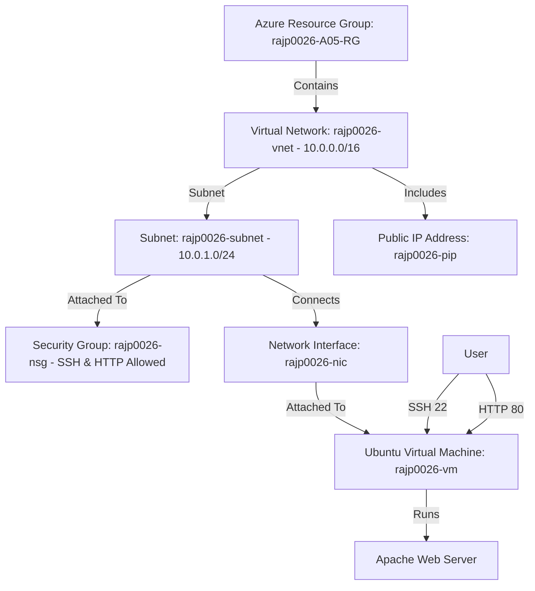
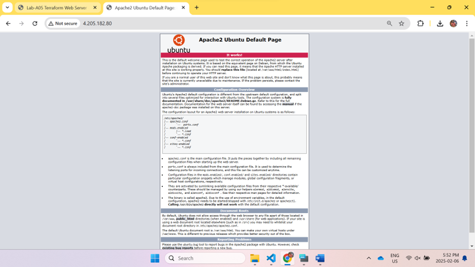
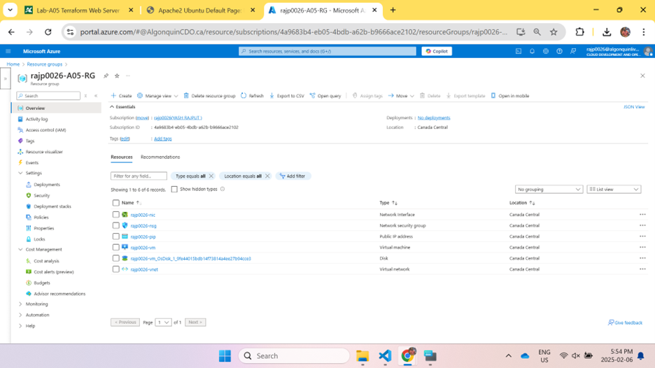
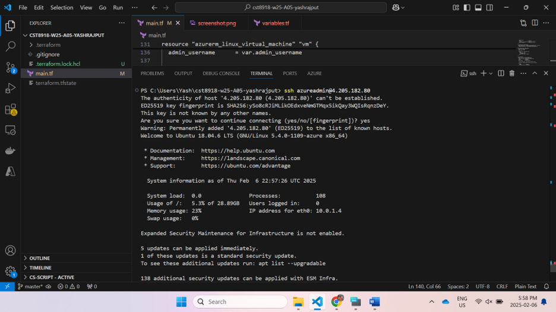

# Terraform Lab A05: Web Server Deployment on Azure

## 📌 Project Overview
This project is part of **CST8918 - DevOps: Infrastructure as Code Lab A05**.  
The goal is to deploy a **web server on Microsoft Azure** using **Terraform**.  
The web server runs **Apache on an Ubuntu Virtual Machine** and is accessible via SSH and HTTP.

## **Architecture Diagram**
The following diagram illustrates the infrastructure deployed using Terraform.



## ⚙️ Prerequisites
Before running Terraform, ensure you have:
- **Git** installed
- **Azure CLI** installed and authenticated (`az login`)
- **Terraform CLI** installed
- **An SSH key pair** for authentication

## 🚀 Deployment Steps
1. **Clone this repository:**
   ```sh
   git clone https://github.com/yashrajput0811/cst8918-w25-A05-yashrajput.git
   ```
2. **Navigate into the project directory:**
   ```sh
   cd cst8918-w25-A05-yashrajput
   ```
3. **Initialize Terraform:**
   ```sh
   terraform init
   ```
4. **Deploy the infrastructure:**
   ```sh
   terraform apply
   ```
5. **Confirm by typing `yes` when prompted.**

## ✅ Verification Steps
After Terraform deploys the infrastructure:
- Copy the **public IP** from Terraform output.
- Open a web browser and visit `http://<PUBLIC_IP>`.
- You should see the **Apache default page**.

## 🗑️ Cleanup (Destroy Resources)
To avoid unnecessary Azure costs, destroy the infrastructure when done:
```sh
terraform destroy
```
Type `yes` when prompted.

## 📷 Screenshots & Architecture Diagram
Below are proof-of-concept screenshots demonstrating the successful deployment.

### 1️⃣ Apache Web Server Running in Browser (`screenshots/a05-demo.png`)


### 2️⃣ Azure Resource Group with Deployed Services (`screenshots/a05-resources.png`)


### 3️⃣ SSH Access to Virtual Machine (`screenshots/a05-ssh.png`)


## 📜 Author
- **Yash Rajput**  
- **Course:** CST8918 - DevOps: Infrastructure as Code  
- **Professor:** Robert McKenney  
